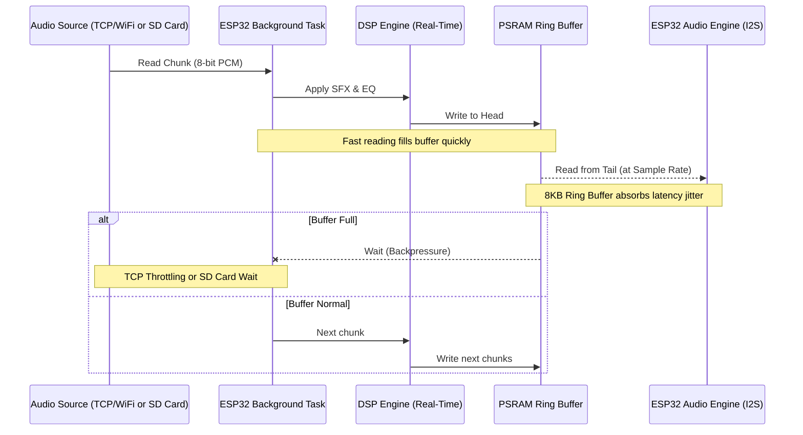
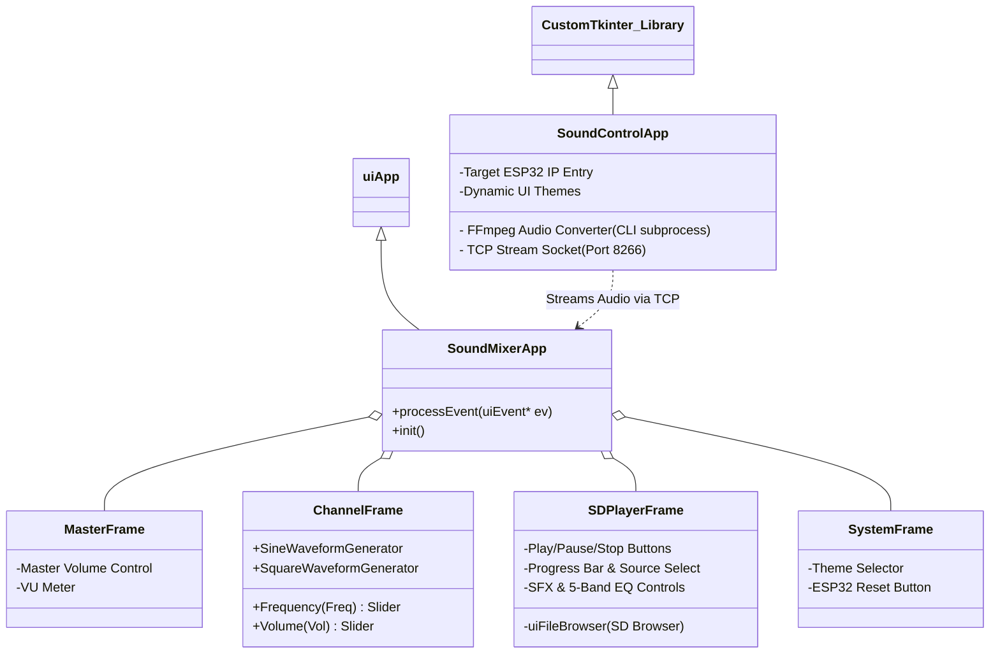
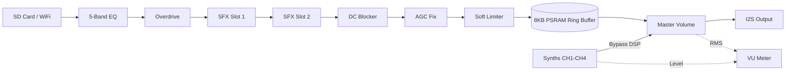
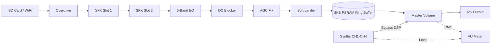
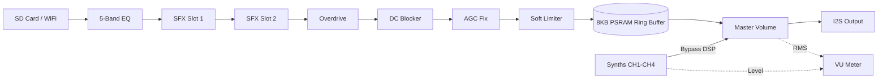
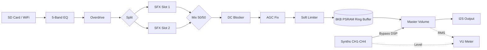
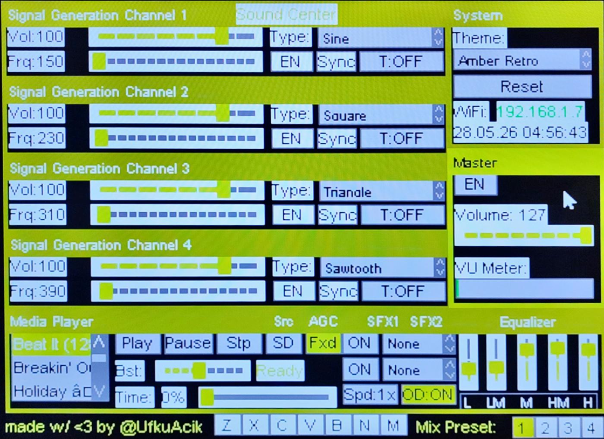
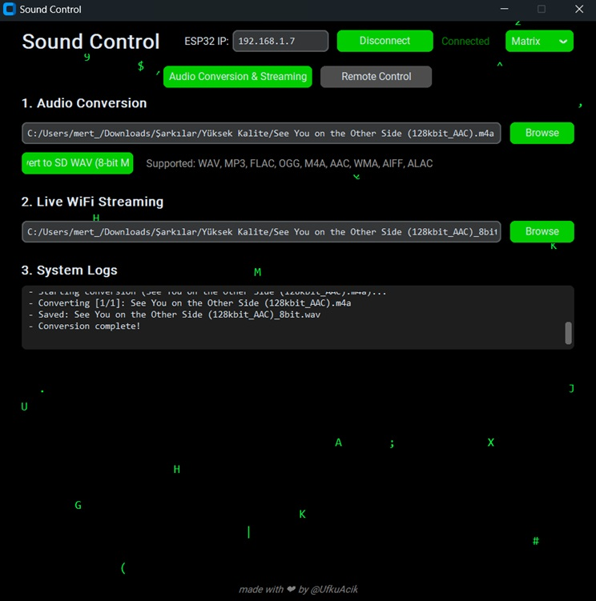
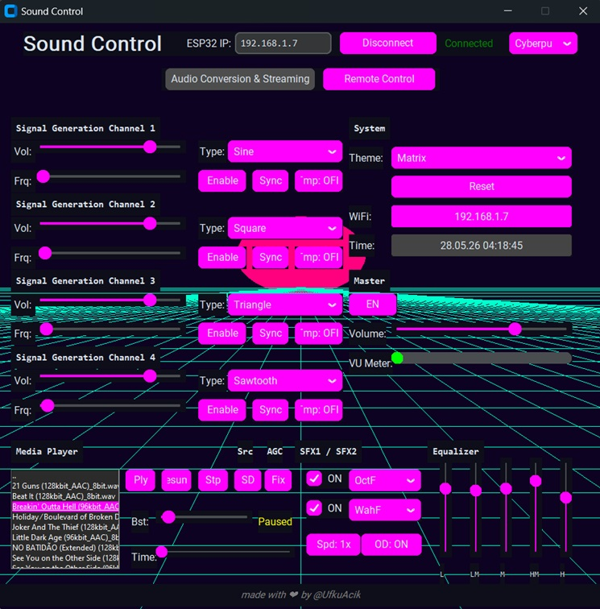

# 🎛️ Sound Center & Sound Control (ESP32 8-Bit Audio Player-Mixer & WiFi Streamer)


**Sound Center** is a comprehensive retro audio platform running on the **Olimex ESP32-SBC-FabGL** board. It features a retro VGA graphical user interface, a 4-channel digital synthesizer, an SD Card media player, dual SFX slots with 31 effects, a 5-Band EQ, 1 VU meter, advanced Digital Signal Processing (DSP), and real-time TCP/WiFi audio streaming via the companion Python PC client (Sound Control).

> 🚀 **Architecture & Optimization:** Extreme emphasis was placed on code architecture and memory/performance optimization throughout this project. It features custom 8KB Ring Buffers utilizing PSRAM to prevent audio stutter, bitmask-optimized buffer pointers, precision `int16_t` scaling for Schroeder Reverb topologies to avoid overflow, and dual-core multithreading (Core 1 for SD Card Playback, Core 0 for WiFi Streaming).

---

## 📋 Table of Contents
1. [Hardware Details](#hardware-details)
2. [System Architecture & Code Logic](#system-architecture)
3. [Digital Signal Processing (DSP)](#dsp)
4. [Requirements & Installation (CRITICAL STEPS)](#requirements)
5. [Python Client Requirements & Installation (CRITICAL STEPS)](#python-requirements)
6. [Usage & Controls](#usage)
7. [Screenshots](#screenshots)
8. [Notes & License](#notes)

---

<a name="hardware-details"></a>
## 🛠️ Hardware Details

This project is not built for a standard ESP32, but specifically for the **Olimex ESP32-SBC-FabGL** development board, which is tailored for retro computing projects.

### 🧩 Main Components on the Board
* **ESP32-WROVER Module:** Dual-Core 240MHz processor.
* **Memory:** 4MB SPI Flash + **8MB PSRAM** (External SPIRAM). *This 8MB PSRAM is vital for audio buffering.*
* **Video Output:** Standard 15-pin VGA connector supporting R2G2B2 (6-bit, 64 colors).
* **Input Devices:** Dual PS/2 Ports (Separate for Keyboard and Mouse).
* **Storage:** MicroSD Card slot (operates in SPI mode).
* **Audio Output:** Built-in Buzzer and 3.5mm Stereo Audio/Line-Out jack (via I2S DAC).

### 📍 Internal Pin Configuration (Olimex FabGL Rev B)
The Olimex board internally wires the hardware directly to the following ESP32 GPIO pins. As this is a pre-assembled board, you do not need to wire anything manually.
* **VGA Pins:** Red0 (21), Red1 (22), Green0 (18), Green1 (19), Blue0 (4), Blue1 (5), HSync (23), VSync (15)
* **MicroSD Card (HSPI):** CS (13), MISO (35), MOSI (12), CLK (14)
* **PS/2 Mouse:** CLK (26), DAT (27)
* **PS/2 Keyboard:** CLK (33), DAT (32)
* **Audio Output (Audio DAC):** DAC1 (GPIO 25)

*For the full schematic, please refer to the official **[Olimex ESP32-SBC-FabGL Rev B Schematic](https://github.com/OLIMEX/ESP32-SBC-FabGL/blob/main/HARDWARE/Hardware-revision-B/ESP32-SBC-FabGL_Rev_B.pdf)**.*

---

<a name="system-architecture"></a>
## 🧠 System Architecture & Code Logic

The system leverages the ESP32's dual cores to concurrently handle video generation, UI management, TCP packet processing, and I2S audio generation.

### 1. Memory and Buffering (Ring Buffer) Architecture
FabGL's default `SamplesGenerator` class can create heap fragmentation and audio stuttering when streaming or playing huge audio files. To overcome this, a custom **8 Kilobyte** `RingBufferGenerator` class is implemented, allocating memory exclusively in the PSRAM (External Memory).



* **WiFi Streaming Flow:** The Python PC Client packs audio into 8-bit PCM and pumps data to the ESP32 via TCP on Port 8266. The WiFi streaming engine uses **TCP_NODELAY** for low-latency transmission, a **64KB send buffer**, and **rate-paced chunk delivery** (0.85x real-time) to keep the connection smooth. The TCP Server Task on the ESP32 fetches these chunks and fills the 8KB PSRAM ring buffer. If the pool gets full, the TCP socket naturally slows down (Backpressure), preventing overflow.
* **SD Card Playback Flow:** The `wavPlayerTask` continuously reads the `_8bit.wav` file from the SD card in 8KB chunks. Because SD cards can have occasional latency spikes, the 8KB PSRAM ring buffer entirely absorbs these spikes, resulting in flawlessly smooth local playback.

### 2. Interface (GUI) Architecture
An object-oriented (OOP) window (Frame) hierarchy is created using the FabGL `uiApp` framework.



* **UI Event Interception (Z-Order Hack):** By overriding the `processEvent` hook inside my custom classes (`ChannelFrame`, `MasterFrame`, `SDPlayerFrame`, `SystemFrame`), I seamlessly intercept `UIEVT_MOUSEBUTTONDOWN` and `UIEVT_SETFOCUS` events. This allows me to keep global elements like the "Sound Center" title always on top of every other UI window naturally within the FabGL event loop thread, entirely avoiding thread-safety issues or screen tearing.
* **NTP Time Synchronization:** The `SystemFrame` panel features a built-in **NTP-Synchronized Date & Time** display. As soon as the ESP32 connects to WiFi, it grabs the local time (default: GMT+3) and displays it directly inside the System panel, keeping the UI active and informative.

### 3. Digital Synthesizer Engine
The `ChannelFrame` supports 4 simultaneous digitally-driven synth channels utilizing high-speed Phase Accumulators. 

1. **Continuous Waveforms:**
   * **Types:** Sine, Square, Triangle, Sawtooth, and Noise.
   * **Features:** These sounds are generated as continuous signals using hardware oscillators. When selected, the **`Freq` (Frequency)** slider becomes visible. You can drag the frequency bar left or right with your mouse to instantly pitch-bend the sound and create smooth, continuous tones just like in retro games.

2. **Percussive & Drum Synths:**
   * **Types:** Kick, Snare, HiHat, Crash, Tom, Clap, Cowbell, Ride, Woodblk, Bongo, Conga, Tambor, Shaker, Laser, Bell, RimSh, FlrTom, Guiro, Maracs, 808K (TR-808 Kick), 808Cl, Timbal, Agogo, TriHit, FMBel, Siren, ZapDn, Metal, PwrK, Buzz.
   * **Features:** These sounds are synthesized using special envelope algorithms that hit and fade out instantly (percussive). Since frequency and duration are controlled by the algorithm, the `Freq` slider is **automatically hidden** by the interface when they are selected.

3. ⏱️ **Auto Tempo (Sequencer) & Sync:**
If you want to bind a percussive sound to a rhythm loop instead of playing it just once, you can use the **`Tmp` (Tempo)** button. Each click on this button changes the tempo interval (*OFF, 0.5s, 1s, 2s, 4s*) or advanced polyrhythmic patterns (*1-2-1, 1-1-2, .5-.5-1, .5-1-.5*). You can build your own drum loops using the 4 channels. 
You can also use the **`Sync`** button to perfectly synchronize the metronomes of all 4 channels, ensuring your multi-channel drum loops hit exactly on the beat simultaneously.

4. 🎹 **Live Piano & Keyboard Synthesizer:**
The system acts as a fully playable digital synthesizer! If you connect a **PS/2 Keyboard** to the Olimex board, you can use the `Z, X, C, V, B, N, M` keys to play live musical notes. The live piano generates pure sine waves layered with sawtooth harmonics for a rich tone. The graphical UI includes clickable piano keys that light up in real-time as you play.

### 4. Media Player & DSP
The `SDPlayerFrame` acts as the central hub for media playback and audio processing. It features a built-in file browser to navigate your SD Card (automatically defaulting to the `/SD/SONGS` directory if it exists to protect against root clutter), a source selector to seamlessly switch between local playback and WiFi streaming, and an integrated interface to manage the powerful backend DSP engine (which is detailed comprehensively in the next main section).

<a name="python-client"></a>
### 5. 🐍 Python Client & Audio Converter (Sound Control)

The Sound Control Python GUI serves as the ultimate companion software for the ESP32. It handles two major tasks: it flawlessly converts any media file into the specific 8-bit format required by the retro hardware using a high-fidelity FFmpeg pipeline, and it acts as a fully-featured WiFi remote control to manipulate the ESP32's synthesizer, effects, and streaming engine in real-time.

#### 🎛️ FFmpeg Audio Conversion Pipeline
The included `SoundControl.py` file converts almost any audio file (WAV, MP3, FLAC, OGG, M4A, AAC, WMA, AIFF, ALAC, etc.) on your computer to the most optimal quality the ESP32 can handle (22050Hz, 8-Bit, Mono).

The audio conversion pipeline leverages the raw power of FFmpeg's advanced audio filters to achieve the absolute mathematical limit of 8-bit audio quality:
1. **Dynamic Audio Normalization (`dynaudnorm`):** A broadcast-grade intelligent normalizer that smoothly rides the volume. It boosts quiet background details without causing the "pumping" effect of traditional compressors and strictly prevents peak clipping.
2. **Alias-Free Resampling (`soxr`):** Downsamples the audio to 22050Hz using the SoX Resampler. This completely eliminates the metallic "aliasing" muddy artifacts that standard resamplers introduce.
3. **Psychoacoustic Dithering (`triangular`):** The bit-depth reduction uses pure TPDF (Triangular Probability Density Function) dither. While noise-shaping algorithms like Shibata are superior for 44.1kHz, at 22050Hz they mathematically compress noise into the audible 8kHz-11kHz band causing whistling artifacts. TPDF remains the mathematically flawless choice for this specific retro hardware.

> ⚡ **Speed & Bulk Conversion:** By offloading the entire pipeline directly to compiled FFmpeg binaries, conversions complete in **1–2 seconds** rather than minutes. You can also **select multiple files at once** to batch convert entire folders in seconds!

#### 📡 Live WiFi Audio Streaming
The Python client doesn't just convert files—it can seamlessly stream the generated 8-bit WAV files directly to the ESP32 over your local network in real-time. After selecting a converted file from the Live WiFi Streaming section, the ESP32 will instantly start playing the audio once you select 'WIFI' as the source in the Media Player window and press Play.


#### 🛜 Real-Time WiFi Remote Control
The Sound Control app doesn't stop there—it functions as a full-fledged remote control for the ESP32 using a secondary TCP Command Socket.
While the ESP32 is running (whether playing audio from the SD Card or Streaming), the Python client allows you to remotely control:
* **Master Volume & Playback Speed:** Send commands like `SET_MASTER_VOL:` or `SET_SPEED:` to instantly alter playback characteristics.
* **DSP Effects (Dual SFX Slots) & EQs:** Adjust the 5-band EQ and control both SFX slots with any of the 31 effects in real-time remotely (`SET_EQ:`, `SET_FX:`, `SET_FX_TYPE2:`).
* **Interface Themes:** Change the visual theme of the ESP32's VGA output instantly via `SET_THEME:`.
* **Signal Generation (CH1-CH4):** Remotely trigger and control all 4 synthesizer channels, percussive sounds, waveforms, frequency, and tempo loops.
* **Full System Control:** Play/Pause, Media Player operations, resets, etc., can be fully managed from your PC. *(Note: The Virtual Piano and the 4 DSP Mix Presets are currently local-only and can only be controlled directly on the ESP32 via its VGA GUI (using a PS/2 Mouse) or PS/2 Keyboard. This limitation is due to a hardware library level constraint, which I plan to resolve in future updates).*

#### 💡 How It Works?
1. Boot up the ESP32. Note the IP address displayed as "WiFi: 192.168.x.x" in the top right corner of the screen.
2. Run `python SoundControl.py`.
3. Enter the ESP32's IP Address into the relevant box and click the **Connect** button.
4. Convert any music file using the **"Convert File to 8-Bit WAV"** button (A new file named `*_8bit.wav` will be created next to the original music file).
5. **For WiFi Streaming:** Under the **"Live WiFi Streaming"** section in the Sound Control app, click the browse button and select the generated 8-bit WAV file. Then, simply click **"WiFi"** as your source in the ESP32's Media Player window and hit **Play**. The music will instantly start streaming and playing over your local network!
6. **For SD Card Playback:** Alternatively, you do not have to stream the audio over WiFi. You can copy the generated `*_8bit.wav` file onto a FAT32 formatted MicroSD card, insert it into the Olimex board, and use the ESP32's **SD Card Player** (in Sound Center GUI) to browse and play it locally with zero network dependency.
7. **For Remote Control:** As long as the Python app is connected to the ESP32's IP address, any slider or button you change on the app (such as Master Volume, EQ, Themes, or Synths) will instantly apply to the ESP32 over WiFi.

---

<a name="dsp"></a>
## 🎛️ Digital Signal Processing (DSP) & Mix Presets

A comprehensive real-time audio processing pipeline (`applyDSP`) is built directly into the ESP32, manipulating raw audio samples just before they reach the I2S DAC. The DSP engine supports **4 distinct Mix Presets (Pipelines)**, which can be selected dynamically from the UI by pressing `1, 2, 3, 4` on your PS/2 Keyboard or with your mouse. Each preset offers a completely unique audio routing topology.

### 1. Standard Series Pipeline (Preset 1)
This is the default traditional audio routing. The audio is equalized and saturated before entering the dual SFX chain.


### 2. Post-EQ Series Pipeline (Preset 2)
In this routing, the Equalizer is placed at the very end of the chain. This is highly useful for sculpting the final frequency response of intense modulation or reverb effects.


### 3. Post-Overdrive Series Pipeline (Preset 3)
In this routing, the Overdrive is placed at the end of the chain. Sending echoes or reverbs directly into an overdrive circuit creates aggressive, smeared, and uniquely distorted "shoegaze" textures.


### 4. Parallel SFX Processing (Preset 4)
This advanced pipeline splits the audio signal into two independent parallel branches for the SFX slots, and then mixes them back together 50/50. Perfect for keeping two intense effects (like heavy distortion and clean echo) from muddying each other.


> **Note:** The DSP pipeline dynamically runs on **Core 1** during SD Card playback, and on **Core 0** during WiFi streaming, perfectly distributing the heavy processing load across the ESP32's dual cores. Digital synth channels bypass the DSP pipeline entirely, going through FabGL's own `SoundGenerator` mixer directly to the DAC.

### ⏩ Real-Time Resampling (Playback Speed)
The system supports altering the playback speed dynamically from **0.25x (Super Slow)** to **2.0x (Double Speed)**. This is achieved through **linear interpolation** resampling during the Ring Buffer read phase (`step = (srcRate * speed) / WAV_PLAY_FREQ`), effectively manipulating pitch and speed simultaneously without pre-processing the file. The linear interpolation between adjacent samples reduces aliasing artifacts compared to basic sample-and-hold resampling.

### 🎚️ 5-Band Equalizer (EQ)
I implemented a multi-band EQ using **Biquad IIR Filters** — a Low Shelf at 100Hz, three Peaking EQ bands at 300Hz, 1kHz, and 3kHz, and a High Shelf at 8kHz. The user can cut or boost each of the 5 bands (Low, Low-Mid, Mid, High-Mid, High) on the fly via the Media Player GUI.

### 🎸 Independent Overdrive & Clipping
An Overdrive circuit is simulated using mathematical **Soft Clipping**. When enabled, the signal is amplified (`x4.0`) and gently saturated at the peaks to introduce harmonic distortion without entirely destroying the audio structure, creating a classic overdrive effect.

### 🌀 31 Audio SFX (Effects) — Dual Slot Architecture
The ESP32 has **two independent SFX slots** that run in series (SFX1 → SFX2). Each slot can be set to any of the 31 available effects, allowing powerful effect chains (e.g., Chorus + Reverb, Lo-Fi + Echo).

* **Time-Based:** Echo (with feedback), Slapback Delay, Reverse Echo.
* **Reverb:** A highly optimized implementation of the **Freeverb Schroeder Topology**, utilizing 4 parallel Comb Filters (int16_t precision) and 2 All-Pass Filters to simulate natural room reverberation.
* **Distortion:** Distortion, Fuzz.
* **Modulation:** Chorus, Flanger, Tremolo, Vibrato, Phaser.
* **Lo-Fi & Pitch:** Bitcrusher, Decimate, Ring Modulator, Sub-Octave, Octave Fuzz, Pitch Shift, Lo-Fi, Sample & Hold.
* **Filters:** Auto-Wah, Telephone Filter, Robotic Voice, Noise Gate, Fixed Wah, Comb Filter, Formant.
* **Creative:** Tape Wow, Stutter, Shimmer, Radio.

### 🔌 DC Offset Blocker
A **1st-Order DC Blocker** filter (`y[n] = x[n] - x[n-1] + 0.995 * y[n-1]`) runs after the SFX processing. This high-pass filter removes any DC offset that accumulates from the EQ, Overdrive, or SFX processing stages, preventing speaker damage and ensuring a clean, centered waveform.

### 🎚️ AGC (Automatic Gain Control) / Volume Fix
The built-in **AGC** (Fix button in the GUI) acts as an intelligent volume riding compressor. When enabled, it constantly analyzes the peak amplitude with a slow envelope (`0.0001f` coefficient). If the signal is too quiet, it automatically applies up to a **+9dB boost**. If it detects loud peaks, it instantly scales back to a **-12dB cut**, targeting a perfectly stable `64.0f` nominal amplitude. This prevents wildly fluctuating volumes across different songs or synth notes.

### 🛡️ Output Soft Limiter
A **soft limiter** engages at ±110 (out of ±128) with a ~6.7:1 compression ratio (0.15 residual factor). Instead of hard clipping, the signal is gently compressed in the last 17 units of headroom. This prevents harsh digital distortion when multiple effects, overdrive, and boost are all active simultaneously.

---

<a name="requirements"></a>
## ⚠️ Requirements & Installation (CRITICAL STEPS)

A standard ESP32 setup is **NOT SUFFICIENT** to upload this project. Please follow these steps in order, precisely:

### 1. Downgrade ESP32 Arduino Core Version
The latest ESP32 Board packages from Espressif (v3.x and above) break the core structure of the FabGL library.
1. Open Arduino IDE. Go to **Tools -> Board -> Boards Manager**.
2. Search for `esp32` (by Espressif Systems).
3. From the version list, select **`2.0.11`** and click **INSTALL**. (Versions 3.0+ WILL ABSOLUTELY NOT WORK).

### 2. Install the FabGL "Olimex Fork"
The original FabGL repository by Fabrizio Di Vittorio is not fully integrated with Olimex hardware. You must install Olimex's customized FabGL fork.
1. Go to: [Olimex FabGL Repo on Github](https://github.com/OLIMEX/FabGL).
2. Click the green **"Code"** button and select **"Download ZIP"**.
3. In Arduino IDE: Go to **Sketch -> Include Library -> Add .ZIP Library** and select the ZIP you just downloaded.

### 3. Enable PSRAM (MANDATORY)
Physical activation of PSRAM is required for the custom Ring Buffer to work.
From the Arduino IDE menu, select the following settings:
* **Board:** ESP32 Wrover Module (or ESP32 Dev Module)
* **PSRAM:** Enabled *(If left Disabled, the ESP32 will constantly reboot!)*
* **Partition Scheme:** Huge APP (3MB No OTA/1MB SPIFFS)

### 4. Hardcode Your WiFi Settings
Before compiling the code, enter your WiFi credentials around **lines 101-102** of the `SoundCenter.ino` file to match your network:
```cpp
const char* WIFI_SSID = "YOUR_WIFI_SSID";
const char* WIFI_PASS = "YOUR_WIFI_PASSWORD";
```

### 5. Configure Your GMT Offset (Timezone)
The system fetches the exact time from NTP servers when connected to WiFi. By default, it is configured for Turkey Time (GMT+3). If you live in a different timezone, find the `configTime` function in `setup()` inside `SoundCenter.ino` and change `3 * 3600` to your local GMT offset in hours:
```cpp
// Change 3 * 3600 to your own GMT offset if needed.
configTime(3 * 3600, 0, "pool.ntp.org", "time.nist.gov");
```

<a name="python-requirements"></a>
## 💻 Python Client Requirements & Installation (CRITICAL STEPS)

### 1. FFmpeg Installation (Mandatory)
The audio conversion system in the Python client (Sound Control) requires FFmpeg to be installed on your system.
* **For Windows:**
  The easiest way to install the exact required FFmpeg build is using the Windows Package Manager (`winget`) from your terminal:
  ```bash
  winget install Gyan.FFmpeg
  ```
  *(The Sound Control script is specifically programmed to automatically detect and link this `winget` installation).*
* **For Linux:**
  You can install FFmpeg using the `apt` package manager:
  ```bash
  sudo apt install ffmpeg
  ```

### 2. Required Python Libraries
Install the package from the command line (Terminal/CMD) using:
```bash
pip install customtkinter
```

---


<a name="usage"></a>
## 🖱️ Usage & Controls

* **Remote vs Local Control:** With the exception of the Virtual Piano and DSP Mix Presets, the entire system can be **fully remote-controlled** from your PC over WiFi using the Python application. For all remote operations (streaming, EQ, FX, synthesis), you do **not** need to connect a PS/2 Keyboard or Mouse to the ESP32.
* **Keyboard & Mouse Requirements:** If you want to use the device locally without a PC, or specifically want to play the Virtual Piano and change DSP Mix Presets, you must connect a **PS/2 Mouse** and/or a **PS/2 Keyboard**. (As mentioned above, the inability to control these two specific features remotely is due to a hardware library level constraint that I plan to resolve in the future).
* **Interface Themes:** From the System panel, you can change device interface themes like *Classic Blue, Matrix, Amber Retro, Dark, Cyberpunk* with a single click. The changed theme is instantly applied everywhere.

---

<a name="screenshots"></a>
## 📸 Screenshots

Here are the screenshots of the Sound Center running on the ESP32 and the Sound Control (Python Client) on PC:

<p align="center">
  
  <br>
  <em>Sound Center: Interactive Retro GUI running directly on the ESP32 via FabGL VGA Output</em>
</p>

<p align="center">
  
  <br>
  <em>Sound Control: Python 8-Bit Converter, Stream and Control Client (Page 1)</em>
</p>

<p align="center">
  
  <br>
  <em>Sound Control: Python 8-Bit Converter, Stream and Control Client (Page 2)</em>
</p>

---

<a name="notes"></a>
## 📝 Notes & License

💡 **Tip:** To easily extract and download audio files from web pages for use with the Sound Center, I recommend **[JDownloader](https://jdownloader.org/)**—a free and open-source media downloader.

📜 **License:** MIT License. Feel free to fork, modify, and use it as you wish.

🤖 *This project was coded and documented with an emphasis on code architecture and optimization by the advanced Antigravity AI agent developed by the Google DeepMind team.*
